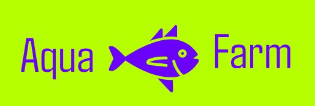
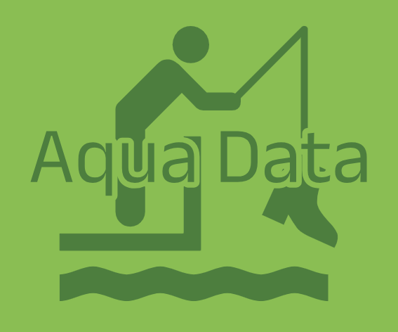

The AquaKube is a vibrant Community that spans aquaculuture equipment, digital platforms, and data worldwide.

Though not a standards body, the AquaKube Community forges new technology norms, fostering an ecosystem where industry players collaborate in a safe framework, shaping a versatile and diverse supply chain.

From startups to hyperscalers as well as research, academia and investors, the AquaKube Community is able to reduce procurement time, research efforts, expenses, development time, and even legal complexity for your projects.

# SHAPING THE FUTURE

The AquaKube Foundation is responsible for fostering, serving and seeding the AquaKube Community to develop new open solutions that can meet the market and shape the future. In shaping the future, AquaKube will continue to invest in strategic initiatives that prepare the IT ecosystem for major changes, such as AI & ML, optics, sustainable data center solutions, advanced power management and cooling techniques, composable silicon and sustainability.
| Farming quipment | Software | Data ML/AI/DL |
| ------------------------------------- | ------------------------------- | ------------------------------------ |
|  |  |  |

| Open specifications for building aquaculture equipment including, feeding, cameras, power, networking | Software to manage and process farm equipment | Normalized data collection and datasets for building AI/ML/DL tools |